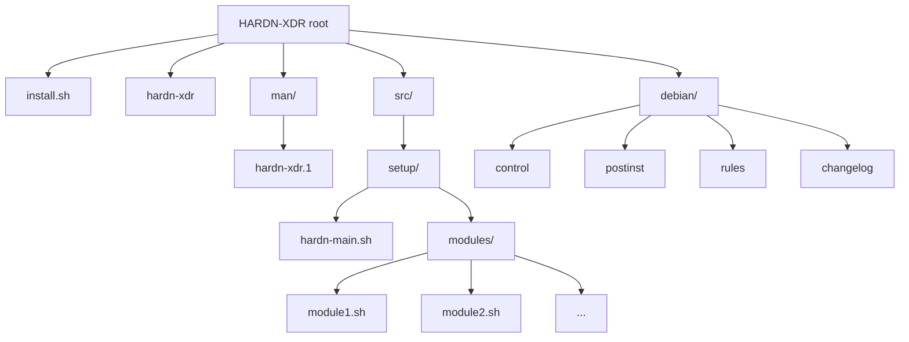

<p align="center">
  <br><br>
</p>

<div align="center">


</div>

<p align="center">
  <br><br>
  <br><br>
  <code>HARDN-XDR</code>
</p>


<p align="center">
  
  
</p>


<br>
<br>
<p align="center">
  <br><br>
</p>


- [](https://github.com/OpenSource-For-Freedom/HARDN-XDR/actions/workflows/ci.yml)
- [](https://github.com/OpenSource-For-Freedom/HARDN-XDR/actions/workflows/codeql.yml)


## HARDN-XDR
- **Our Goal**: 
  - Assist the open source community in building **Container and VM optimized** Debian based security hardening for **DISA/FEDHIVE compliance**, with Multi Architecture capabilities.
- **Our Purpose**: 
  - To empower IT administrators with automated container and VM security hardening tools that ensure DISA compliance, optimize performance, and maintain regulatory standards across containerized and virtualized environments.
- **What we have to offer**:
  - A **container and VM-first** security hardening solution optimized for containerized workloads and virtual machines.
  - Intelligent environment detection that applies appropriate security modules based on deployment context.
  - **DISA/FEDHIVE compliance** focused hardening with performance optimization for container and VM environments.
  - `STIG` COMPLIANCE to align with the [Security Technical Information Guides](https://public.cyber.mil/stigs/) provided by the [DOD Cyber Exchange](https://public.cyber.mil/).
  - Desktop compatibility maintained for traditional deployments.


<br>
<br>
<p align="center">
  <br><br>
</p>

## Environment-Optimized Security
- **Container/VM Priority**: Automatically detects container and VM environments and applies optimized security modules for performance and compliance.
- **DISA/FEDHIVE Compliance**: Essential security modules specifically selected for government and enterprise compliance requirements.
- **Performance Optimization**: Skips desktop-focused modules (USB/FireWire blocking, GUI sandboxing) in container/VM environments.
- **Intelligent Module Selection**: Categorizes modules as Essential, Conditional, or Desktop-focused based on environment.

## Core Security Features  
- **Comprehensive Monitoring**: Real-time insights into endpoint performance and activity.
- **Enhanced Security**: Protect endpoints with advanced security protocols optimized for containers and VMs.
- **Scalability**: Manage security across small to large-scale containerized and virtualized networks.
- **User-Friendly Interface**: Intuitive design for seamless navigation and management.
- **Interactive Menu**: Environment-aware menu to select appropriate hardening modules.
- **STIG Compliance**: Government-grade security hardening for containerized and virtualized information systems.
- **Matrix-Themed Dashboard**: Cyberpunk-styled compliance dashboard with real-time security metrics and visual reporting. 


<br>
<br>
<p align="center">
  <br><br>
</p>

## Container and VM-First Architecture

HARDN-XDR automatically detects your deployment environment and optimizes security hardening accordingly:

### Container/VM Environment (Recommended)
When running in containers or VMs, HARDN-XDR:
- **Essential Modules**: Applies 21 core DISA/FEDHIVE compliance modules
- **Performance Optimized**: Skips desktop-focused modules (USB/FireWire, GUI sandboxing)  
- **Container-Aware**: Handles systemd, networking, and service limitations gracefully
- **Compliance Focused**: Prioritizes audit logging, access controls, and system hardening

### Essential Container/VM Modules
- Audit logging (auditd, audit_system)
- Kernel security parameters
- SSH hardening and access controls
- File integrity monitoring (AIDE)
- Password policies and credential protection
- System logging and time synchronization
- Package integrity and management

### Optional Container/VM Modules
- Network intrusion detection (Fail2ban, Suricata)
- Malware detection (YARA, RKHunter)
- Advanced access controls (SELinux, AppArmor)

### Desktop/Physical Environment
Maintains full compatibility with all 41+ security modules for traditional deployments.

### Environment Variables
Set `HARDN_CONTAINER_VM_MODE=1` to force container/VM optimization mode.

<br>
<br>
<p align="center">
  <br><br>
</p>

## Quick Start 

### Install from GitHub

- HARDN-XDR is being tested for "Multi-Arch" deployments, specify your architecture from the releases page and change the install commands accordingly. 

1. Download the latest `.deb` package: [amd64:arm64]
   Visit: https://github.com/OpenSource-For-Freedom/HARDN-XDR/releases

2. Install the package:
```bash
sudo apt install ./hardn_*_amd64.deb
```

3. Run the tool:
```bash
sudo hardn-xdr
```

4. Run compliance audit and view dashboard:
```bash
sudo ./hardn_audit.sh
```

After running the audit, access the live dashboard at: **[http://localhost:8021/hardn-compliance.html](http://localhost:8021/hardn-compliance.html)**

### To access the man page

```bash
man hardn-xdr
```
---

<br>
<br>
<p align="center">
  <br><br>
</p>

## Matrix-Themed Security Dashboard

HARDN-XDR includes a compliance dashboard that provides real-time security metrics and visual reporting.

### Dashboard Features
- **Automated Deployment**: After running the auditing script, the dashboard produces compliance reporting.
- **Real-Time Metrics**: Live compliance percentages and security status
- **Multi-Standard Support**: DISA STIG, FIPS 140-2, CIS Controls, and Debian Security
- **Visual Charts**: Animated progress bars and compliance meters
- **Auto-Server**: Automatically starts web server after audit completion
- **Interactive Elements**: Hover effects and glowing animations

### Accessing the Dashboard

1. **Run Compliance Audit**:
```bash
cd /path/to/HARDN-XDR
sudo ./hardn_audit.sh
```

2. **View Live Dashboard**:
   - **Dashboard URL**: [http://localhost:8021/hardn-compliance.html](http://localhost:8021/hardn-compliance.html)
   - **Port**: 8021
   - **Auto-Start**: Server launches automatically after audit

3. **Stop Dashboard Server**:
```bash
pkill -f 'python.*8021'
```

### Dashboard Sections
- **Executive Summary**: Overall compliance percentage and critical findings
- **Compliance Progress**: Standard-specific progress meters (STIG, FIPS, CIS, Debian)
- **Detailed Findings**: Categorized security check results with status indicators
- **Visual Charts**: Bar charts showing passed/failed/warning statistics

---

### Installation Notes
- HARDN-XDR is currently being developed and tested for **BARE-METAL installs of Debian based distributions and Containers**.
- Ensure you have the latest version of **Debian 12**.
- By installing HARDN-XDR the following changes will be made to your system:
> - A collection of security focused packages will be installed.
> - Security tools and services will be enabled.
> - System hardening and STIG settings will be applied.
> - A malware and signature detection and response system will be set up.
> - A monitoring and reporting system will be activated. 
- For a detailed list of all that will be changed, please refer to [HARDN.md](docs/HARDN.md).
- For an overview of HARDN-Debian STIG Compliance, please refer to [deb_stig.md](docs/deb_stig.md).
- For threat research and security enhancements, please refer to [Threat Research](docs/threat-research/).

### Multi-Architecture CI Support
- **AMD64**: Full module testing including resource-intensive security tools
- **ARM64**: Optimized testing that skips heavy modules (YARA, RKHunter, AIDE, etc.) during CI due to QEMU emulation performance limitations
- **Production**: All modules are fully functional on both architectures in production deployments

---

## File Structure



<br>

<p align="center">
  <br><br>
</p>


<p align="center">
  
</p>
<br>

<p align="center">
  <br><br>
This project is licensed under the MIT License.
  
</p>

<br>

<p align="center">
  <br><br>
office@cybersynapse.ro
