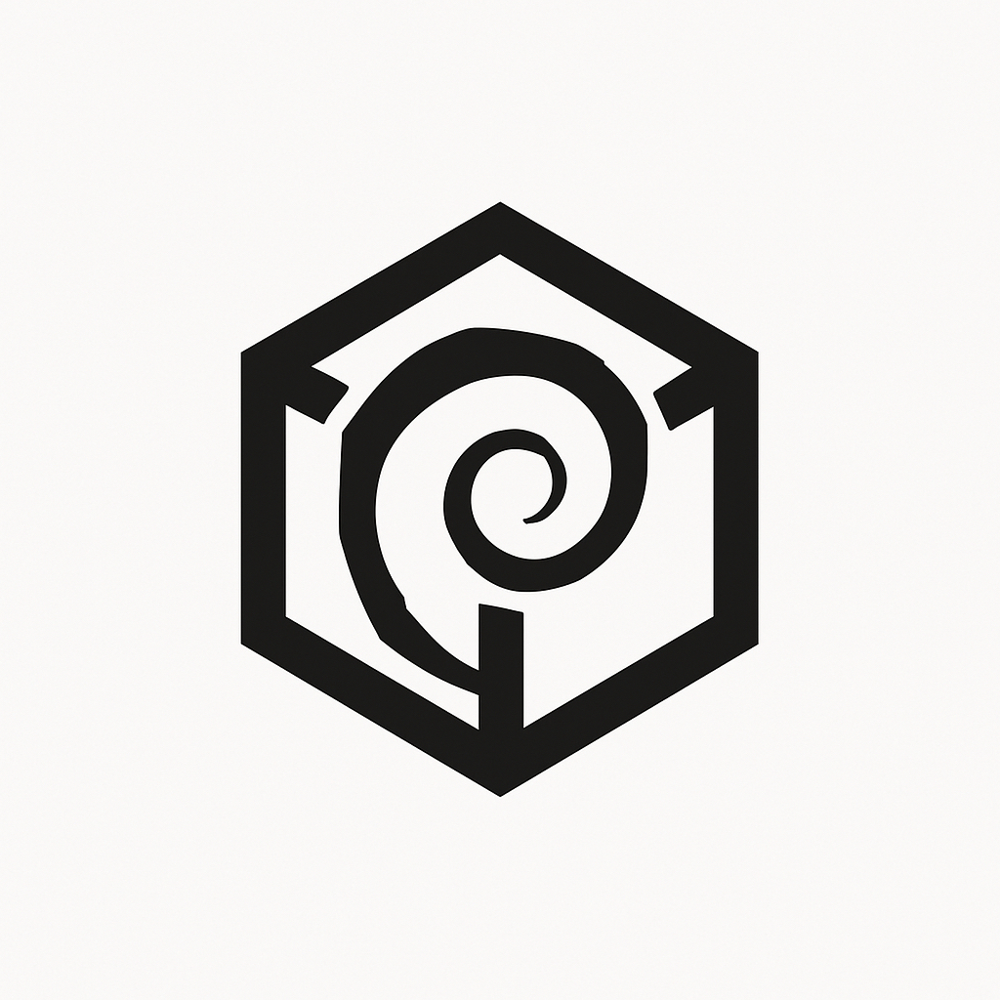
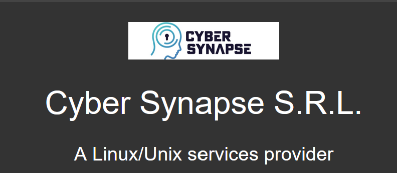

<p align="center">
  <br><br>
</p>

<p align="center">
  <br><br>
  <br><br>
  <code>HARDN-XDR</code>
</p>


<p align="center">
  <br><br>
</p>


### HARDN-XDR
- **Our** Goal: assist the open source community in building a Debian based **"GOLDEN IMAGE"** System.
- This Debian Package is only tested for **BARE-METAL installs of Debian based distributions and Virtual Machines**
- Is a robust and secure endpoint management solution designed to simplify and enhance the management of devices in your network. It provides advanced features for monitoring, securing, and maintaining endpoints efficiently.
- We also bring you with this release `STIG` COMPLIANCE to align with the Security Technical Information Guides provided by the DOD Cyber Exchange.

<p align="center">
  <br><br>
</p>

- **Comprehensive Monitoring**: Real-time insights into endpoint performance and activity.
- **Enhanced Security**: Protect endpoints with advanced security protocols.
- **Scalability**: Manage endpoints across small to large-scale networks.
- **User-Friendly Interface**: Intuitive design for seamless navigation and management.
- **STIG Compliance**: This release brings the utmost, security for Debian Government based informatin systems. 


### Actions
- [](https://github.com/OpenSource-For-Freedom/HARDN-XDR/actions/workflows/validate.yml)

### File Structure


```bash
HARDN/
├── .gitignore
├── README.md
├── changelog.md
├── docs/
│   ├── deb_stig.md
│   ├── HARDN.md
│   ├── LICENSE
│   └── assets/
│       ├── HARDN(1).png
│       └── cybersynapse.png
├── src/
│   └── setup/
│       └── hardn-main.sh
├── debian/
│   ├── changelog
│   ├── control
│   ├── hardn.install
│   ├── postinst
│   └── rules
```

</p>


<p align="center">
  <br><br>
</p>

The purpose of HARDN-XDR is to empower IT administrators and users with the tools they need to ensure endpoint security, optimize performance, and maintain compliance across their organization.

<p align="center">
  <br><br>
</p>


## Quick Start: 

### Installation

1.  **Download the HARDN script:**
    Open your terminal and run the following command to download the main script:
    ```bash
    curl -LO https://raw.githubusercontent.com/OpenSource-For-Freedom/HARDN-XDR/main/src/setup/hardn-main.sh
    ```

2.  **Run the HARDN setup:**
    Launch the script with superuser privileges to begin the hardening process:
    ```bash
    sudo chmod +x hardn-main.sh
    sudo ./hardn-main.sh
    ```
    This will start the HARDN setup menu. Follow the on-screen prompts to configure and apply security hardening to your system. 


### Updates in Version 1.1.8
- Built and tested Debian packaging.
- Enhanced GRUB security to respect GUI changes and user-defined settings in setup.
- Improved error handling and script optimization.
- Interactive Setup
- Updated documentation and ensured cron jobs are non-intrusive.


### Installation Notes
- Ensure you have the latest version of Debian 12 or Ubuntu 24.04.
- Follow the updated installation steps in the `docs` directory.


<p align="center">
  <br><br>
</p>


<p align="center">
  
</p>


<p align="center">
  <br><br>
This project is licensed under the MIT License
  
</p>


<p align="center">
  <br><br>
office@cybersynapse.ro
</p>


